# Pure Pursuit Path Tracking with BST Waypoint Navigation

  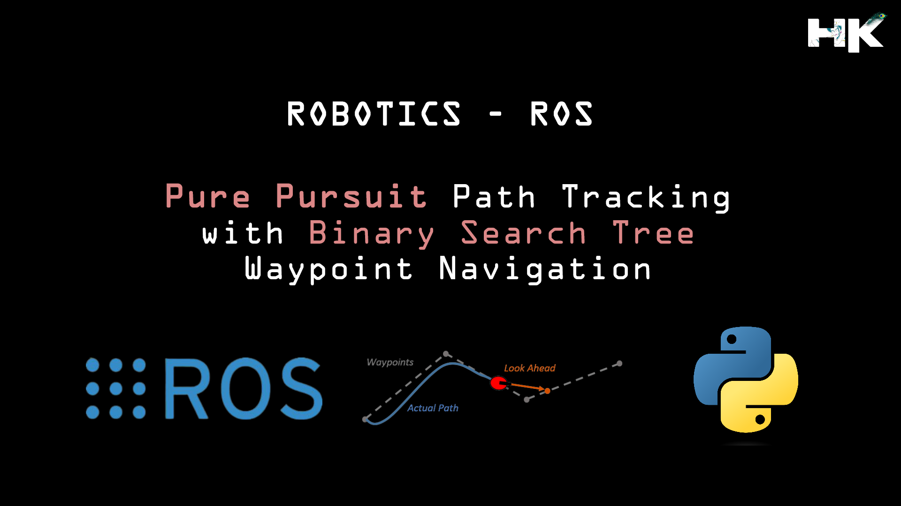

---------------------------------------------

## About this Project:
A Pure Pursuit Controller is a Path Tracking Algorithm often used in robotics and autonomous vehicles for following a predefined path autonomously.
In autonomous robotics, the ability to follow a predetermined path with accuracy and adaptability is critical. Applications range from industrial robots following lines on a factory floor, drones navigating through an environment, or autonomous cars driving on a road. The Pure Pursuit algorithm's effectiveness has been proven in various fields, including agricultural automation, where vehicles must follow precise paths for tasks like planting or harvesting.

  

---------------------------------------------

## Advantages of Pure Pursuit:
The project is designed to demonstrate a reinforcement learning (RL) scenario where an AI agent is tasked with balancing a ball on a slab. The agent receives a small positive reward incrementally for each time step that the ball stays on the slab, encouraging the agent to learn strategies for maintaining balance. Conversely, a negative reward is given when the ball falls off, which helps the agent to learn from its mistakes and avoid actions leading to such an outcome. The control mechanism allows the slab to be rotated along two axes, which adds complexity to the task and requires the agent to develop a nuanced understanding of the physics involved.

    • Simplicity: Pure Pursuit is straight forward to understand and implement.
    • Reactivity: It's a reactive algorithm that can adjust to changes in the robot's position.
    • Smoothness: It results in smooth paths due to the circular arc-based steering, which is important for applications where jerk or sudden changes.
    • Versatility: It can be used with different types of robots and vehicles - wheeled robots, drones, and autonomous cars can all use Pure Pursuit for path tracking.
    • Predictability: The behavior of the PP controller is predictable and reliable, which is essential for safety in autonomous systems.
    
---------------------------------------------

## Working of Pure Pursuit Algorithm:

  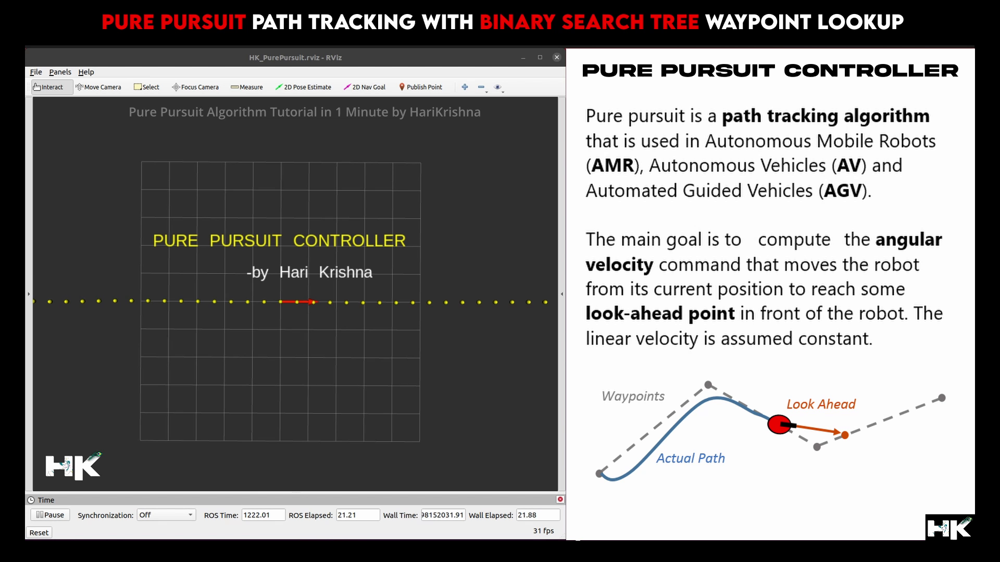

  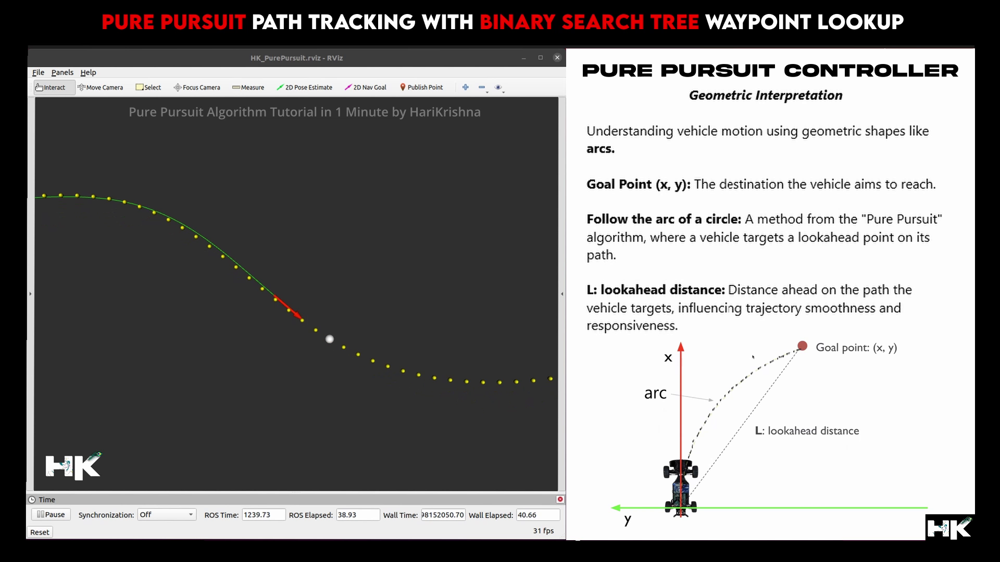

  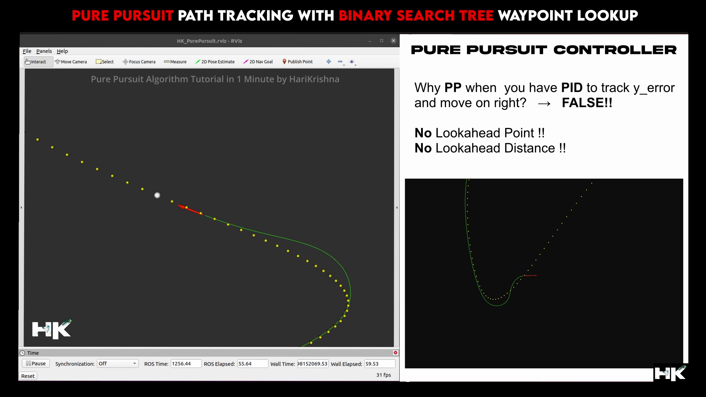

  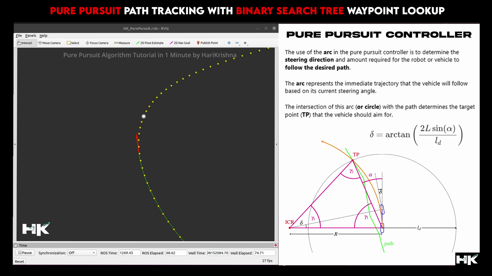

  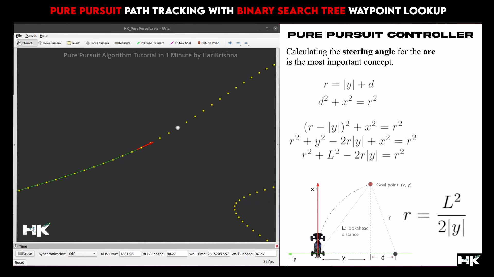

  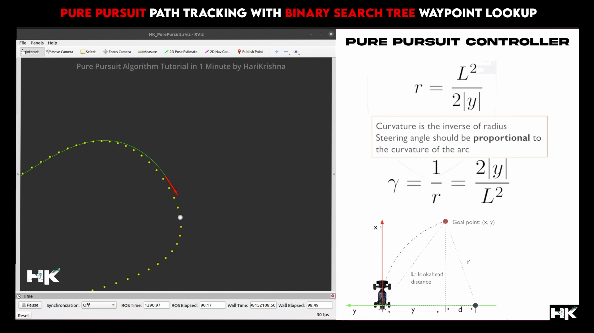

  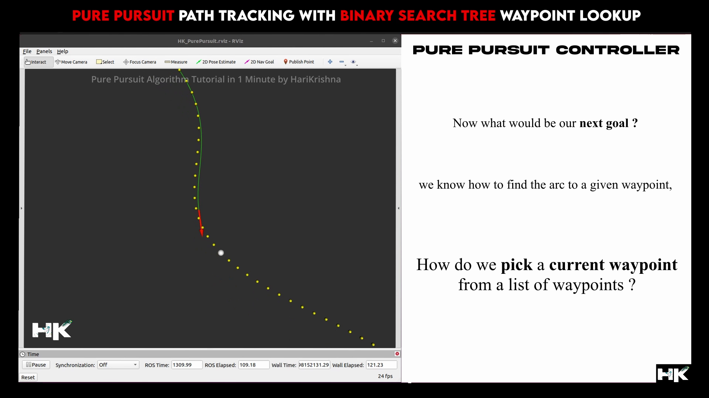

  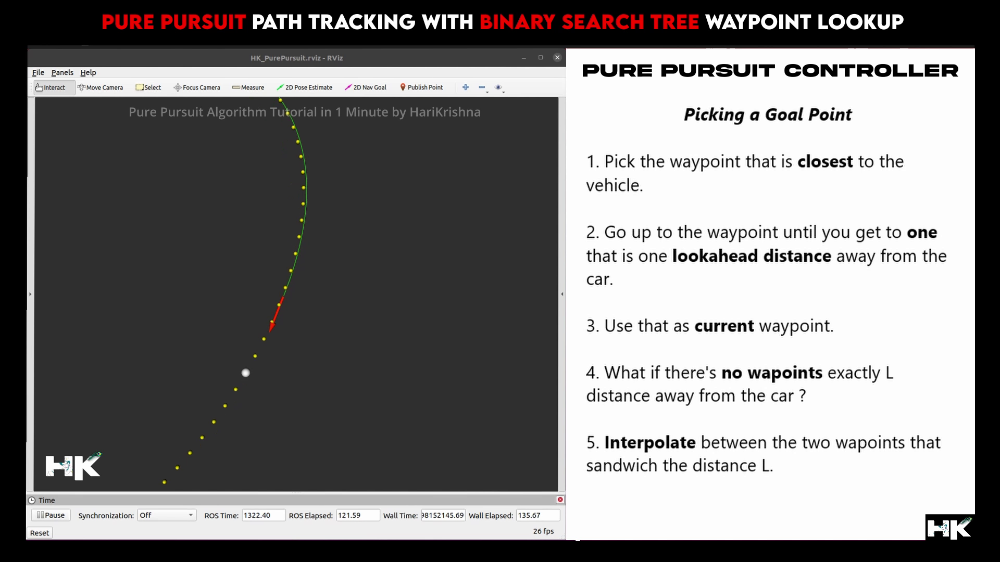

  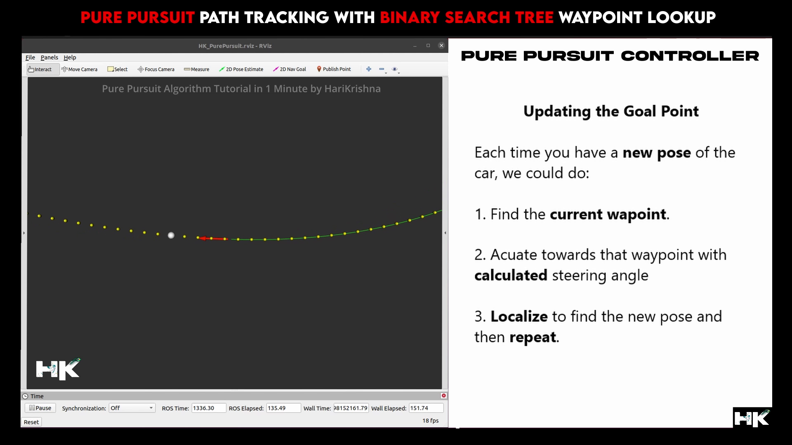

  

  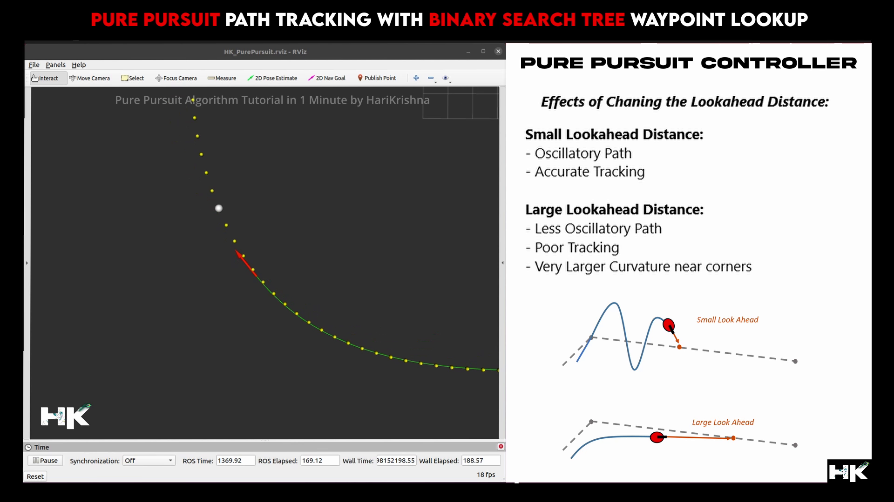

---------------------------------------------

## Testing and Results:
By employing a Binary Tree search algorithm for waypoint navigation, I achieved over 98% accuracy in my path tracking tests conducted in ROS. Below is a link where you can view a video demonstrating how precisely the controller follows the designated path.

---------------------------------------------

## My Project Video Demonstration:

  

---------------------------------------------
